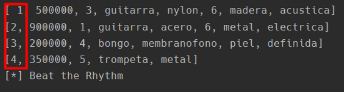
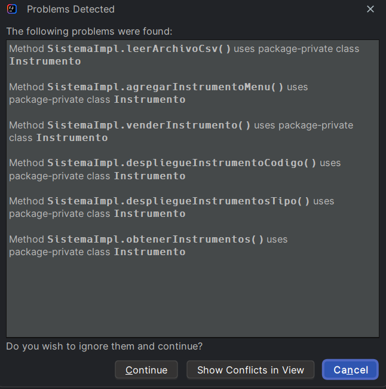
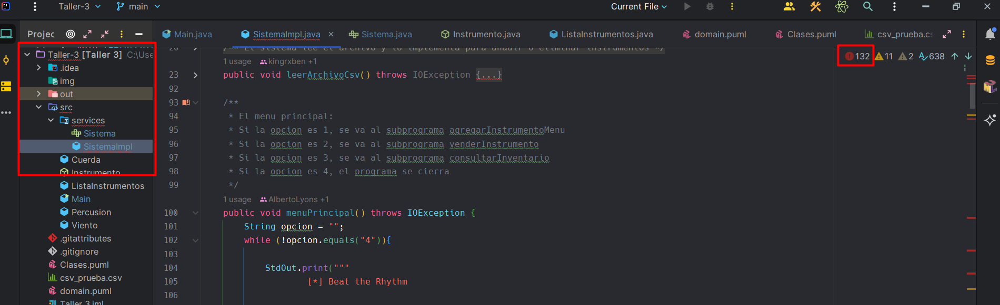

# Taller 3

## Integrantes:
- Alberto Lyons
- Rubén Macaya

## * Nota *
Surgieron problemas al realizar la lectura desde el archivo csv, inclusive después de una reunión con el profesor este error seguía, es por eso que la lectura hecha del archivo lee el código incluyendo el espacio que existe. Tambien otro problema que se experimento es al tratar de agregar las clases en packages, adjuntaremos imagentes de ambos problemas. Realizamos este procedimiento por recomendacion del profesor para dejar constancia.

## Imagenes

### Problemas con el archivo .csv

### Problemas respecto al packages

